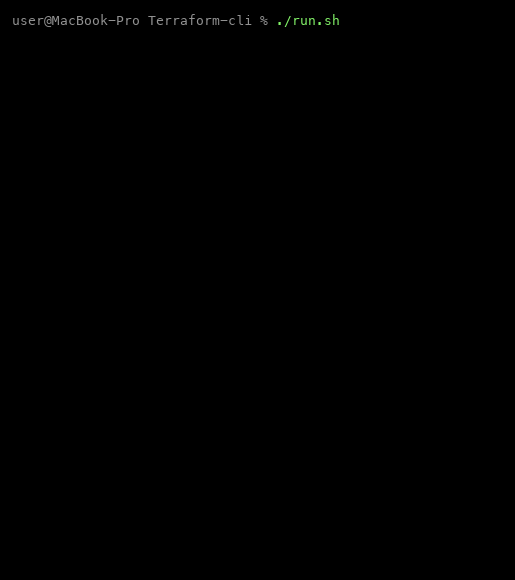

## Демонстрация

Анимация построена по реальному фрагменту вывода `./run.sh`



## Зачем этот проект

Новая виртуальная машина в облаке требует одних и тех же шагов: обновить систему, поставить пакеты, настроить SSH, фаервол, по желанию Docker и VPN. Этот репозиторий — набор bash-скриптов, которые делают это с вашего компьютера по SSH по данным из `config.yml` и `credentials.yml`.

Подробные требования к ОС и порядок этапов зафиксированы в `spec.md`. Сценарии лежат в `dist/`; точка входа — `./run.sh`.

## Что делает `./run.sh` с точки зрения пользователя

1. **Локально** проверяет ОС и наличие `yq` и `sshpass`, при необходимости подсказывает установку через Homebrew или apt.
2. Читает **учётные данные** из `credentials.yml`. Пустые поля (например IP) можно ввести в терминале.
3. Готовит **SSH-ключ** и копирует его на сервер (`ssh-copy-id`), затем проверяет вход **по ключу** без пароля.
4. На **сервере** показывает версию Ubuntu (ожидается поддерживаемый релиз по `spec.md`).
5. Дальше по очереди подключаются модули из `dist/main.sh` — порядок важен (сеть → SSH → фаервол → остальное):
   - отключение IPv6 — если включено в `config.yml`;
   - обновление пакетов (apt), при необходимости перезагрузка;
   - установка пакетов из `vps.packages`;
   - пользователи из `vps.users` (пароли, sudo, ключи);
   - усиление `sshd`, смена порта SSH из `applications.ssh.port` при настройке модуля;
   - UFW и fail2ban (если заданы в `applications`);
   - **Docker** — если в `config.yml` есть ключ `applications.docker`;
   - **Outline VPN** — если есть `applications.outline` (нужен уже установленный Docker); в конце в консоль выводится JSON доступа для Outline Manager.

Модуль **OpenVPN** в `main.sh` по умолчанию закомментирован; раскомментируйте строку с `openvpn/task.sh`, если нужен.

Вывод удалённых сценариев **не дублируется в консоль целиком**: он пишется в каталог `logs/`. При ошибке скрипт обычно показывает **абсолютный путь к логу** (удобно открыть из терминала IDE). Перед каждым запуском содержимое `logs/` очищается, чтобы не путаться в старых прогонах.

В `config.yml` в секции `client` можно задать таймаут SSH и число попыток переподключения.

## Конфигурация

| Файл | Назначение |
|------|------------|
| `credentials.yml` | IP, порт SSH, пользователь и пароль для **первого** входа и копирования ключа. Пароль и IP не коммитьте в открытый репозиторий. |
| `config.yml` | Пакеты, флаги (например IPv6), блок `applications` (ssh, ufw, fail2ban, docker, openvpn, outline и т.д.), список пользователей на VPS, настройки клиента (`ssh-connect-timeout`, `ssh-reconnect-attempts`). |

Приложения из `applications` обрабатываются только если для них объявлен ключ в YAML (см. `dist/libs/vps-config.sh`).

## Как запустить

```bash
git clone https://github.com/SevaSport/Terraform-cli.git ./Terraform-cli
cd ./Terraform-cli
chmod +x run.sh
./run.sh
```

Убедитесь, что в `credentials.yml` указан актуальный IP и что с вашей машины доступен SSH к VPS.
